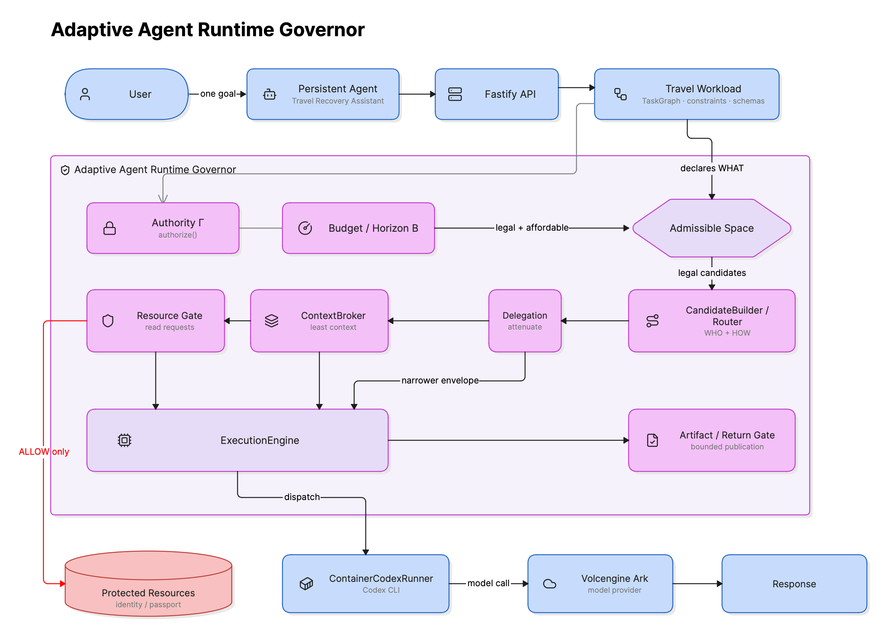

# Agent Launchpad

**Adaptive runtime governance for AI agents**

TikTok TechJam 2026 · Track 1 — Agent Infrastructure / Middleware

Agent Launchpad decides at runtime whether a task should stay with the current agent or be
delegated, and whether work should run directly, serially, or in parallel. It makes those
choices only after enforcing authority and a shared run budget.

Every routing decision, protected-resource access, context handoff, artifact, and usage update
is recorded in one evidence ledger. The same evidence drives later decisions and powers the
read-only Runtime Governance Inspector.

> **The key separation:** hard governance defines what is allowed; adaptive routing chooses
> the best option from that legal set. A routing score can never override a denial.


> [!WARNING]
> This is a proof of concept, not a production security boundary. Use only synthetic data and
> test credentials. See [Known limitations](#known-limitations).

## Why this matters

Most agent systems choose a topology in advance. A fixed multi-agent graph wastes cost and
shares context on simple work; a fixed single agent misses useful specialization and
parallelism on complex work.

Agent Launchpad treats topology as a governed runtime decision:

```text
workload declares tasks
        ↓
authority + budget remove illegal or unaffordable options
        ↓
router chooses WHO and HOW
        ↓
execution produces artifacts and real usage
        ↓
ledger updates the state used by the next decision
```

## What is implemented

| Component | Responsibility |
| --- | --- |
| Governance kernel | `authorize()` is the only source of `ALLOW` and `DENY`. |
| Adaptive router | Chooses `REUSE_CURRENT` or `DELEGATE_SPECIALIST`, plus `DIRECT`, `SERIAL`, or `PARALLEL`. |
| Delegation | `deriveChildEnvelope()` can only reduce authority, depth, and child slots. |
| Context broker | Sends only task-relevant, authorized context and records what was withheld. |
| Resource and Return Gates | Mediate protected reads and schema-validated cross-agent artifacts. |
| Run budget | Records executor-reported usage and uses it in later routing decisions. |
| Evidence ledger | Stores typed runtime evidence and projects a bounded view to the browser. |

The middleware is workload-independent. Travel is the reference workload used to make these
boundaries easy to inspect.

## Three-minute demo

Use this prompt:

> My flight from Singapore to Tokyo tonight was cancelled. I need to arrive before 1 PM
> tomorrow. Keep extra spend under SGD 700 and ask me before anything over SGD 300. Find a safe
> recovery plan, but don't book anything without my approval.

The workload declares this task graph:

```text
understand disruption
        ↓
search transport ─────────┐
                          ├─ may run in parallel
search accommodation ─────┘
        ↓
plan local arrival → verify identity → validate plan → produce final plan
```

During the run, look for four things:

1. Transport and accommodation expand into parallel specialist work.
2. The root's direct passport read is denied with `NOT_EXERCISABLE_DELEGATE_ONLY`.
3. An identity specialist receives narrower authority, reads the passport through the Resource
   Gate, and returns four booleans—not the passport contents.
4. Final synthesis contracts to `REUSE_CURRENT / DIRECT`, while run pressure reflects real
   executor usage.


The final answer is rendered from a schema-validated result containing only:

```text
transport_option_id · accommodation_option_id · route_option_id
final_arrival · total_additional_spend_sgd · approval_required · status
```

Raw child output and protected passport data never enter the parent prompt or browser.

## Quick start

Requirements: Node.js 22+, npm 10+, Docker/Colima/Podman, a Volcengine Ark API key, and a
Responses-capable Ark endpoint. The Runtime image includes Codex CLI.

```bash
ARK_API_KEY=your-ark-api-key \
ARK_MODEL=ep-your-endpoint-id \
npm run poc
```

Open <http://localhost:3000>, create an agent, send the demo prompt, and open **Runtime
governance**. `Ctrl+C` stops the platform and removes temporary Runtime containers while
keeping local workspaces and conversations.

`.env` is not loaded automatically. Export variables or pass them inline. See
[`.env.example`](.env.example) for the full configuration.

## How a governed run works



1. A user goal creates one run with shared task state, authority, budget, and evidence.
2. The workload declares tasks, not an agent topology.
3. Authority and budget filter candidate execution plans before ranking.
4. The router selects an executor and execution mode from the remaining candidates.
5. Delegated workers receive an attenuated authority envelope and least-privilege context.
6. Resource reads and cross-agent returns pass through backend gates.
7. Real usage, artifacts, and decisions are appended to the ledger.
8. The next task is routed from the updated run state.

Child authority is constructed rather than copied:

$$\Gamma_{child}=\Gamma_{parent,delegatable}\;\sqcap\;\Gamma_{requested}\;\sqcap\;\Gamma_{policy}$$

This makes capability expansion structurally invalid. The browser cannot create or amend
policy truth; it only renders a bounded backend projection.

## Evidence and verification

Inspector fields state where their values came from:

| Label | Meaning |
| --- | --- |
| `OBSERVED` | Direct runtime or ledger evidence. |
| `DERIVED` | Deterministically computed from ordered backend evidence. |
| `DECLARED` | Workload contract or schema. |
| `UNAVAILABLE` | No backend evidence exists; the UI does not invent a default. |

Run the full local check:

```bash
npm run check
```

This runs type checks, 432 tests across 38 files, and both server and web builds. Coverage
includes authorization denial, forged authority, delegation attenuation, budget exhaustion,
context redaction, artifact schemas and recipients, Return Gate behavior, adaptive routing,
and governed-run projections.

Useful evidence:

| Evidence | Location |
| --- | --- |
| Real Container/Codex/Ark run | [`reports/stage7d-travel-runtime-proof-attempt-4.json`](reports/stage7d-travel-runtime-proof-attempt-4.json) |
| Backend audit and hardening record | [`docs/STAGE_7D5_BACKEND_SIGNOFF.md`](docs/STAGE_7D5_BACKEND_SIGNOFF.md) |
| Deterministic lifecycle | [`apps/server/src/workload/travel-disruption/`](apps/server/src/workload/travel-disruption/) |
| Workload contract | [`docs/TRAVEL_LIFECYCLE.md`](docs/TRAVEL_LIFECYCLE.md) |

The deterministic path supports offline tests. The demo uses the real provider path and never
silently substitutes deterministic evidence. Historical live proofs have their own configured
budgets and prove only the fields recorded at the time; newer routing invariants are covered by
the deterministic suite.

## Repository map

```text
apps/server/src/
├── middleware/
│   ├── governance/   # authorization, grants, attenuation, gates, artifacts
│   ├── adaptive/     # candidates, router, task graph, ContextBroker
│   ├── evidence/     # ledger and GovernedRunView projections
│   └── runtime/      # delegated agent launcher
├── workload/
│   └── travel-disruption/
├── container-codex-runner.ts
├── agent-service.ts
└── app.ts

apps/web/src/governance/  # read-only Runtime Governance Inspector
docs/                     # architecture, lifecycle, hardening, deployment
reports/                  # sanitized runtime proofs
scripts/                  # startup and validation helpers
```

Dependency direction is `workload → middleware`; the middleware contains no Travel policy.

## Configuration

| Variable | Default | Purpose |
| --- | --- | --- |
| `ARK_API_KEY` | Required | Ark API key. |
| `ARK_MODEL` | Required | Responses-capable endpoint/model ID. |
| `ARK_BASE_URL` | Beijing v3 endpoint | Ark OpenAI-compatible API URL. |
| `HOST` | `127.0.0.1` | Server bind address. |
| `APP_AUTH_TOKEN` | Empty on loopback | Shared demo token; required off loopback. |
| `RUNTIME_PROVIDER` | `local-process` | Set to `container` for disposable Runtime containers. |
| `CODEX_SANDBOX_MODE` | `workspace-write` | Inner Codex sandbox mode. |
| `LOCAL_POC_DATA_ROOT` | Platform-specific | Local metadata, workspaces, and sessions. |

## Known limitations

- Human identity is not authenticated. `x-principal-id` is a selector, not a credential; the
  default loopback binding makes this a single-owner demo.
- Complete mediation covers governed crossings, not arbitrary filesystem or network activity.
  Protected resources must remain behind backend-managed boundaries.
- Budget accounting occurs after each call, so one in-flight invocation may overshoot the cap.
- The Return Gate bounds artifact type, fields, and recipients; it is not zero-information
  leakage or a complete revocation model.
- `maxToolCalls` is reported metadata, not an enforced cap.
- Storage and coordination are single-process, and Travel resources are synthetic. No airline,
  hotel, passport, payment, or booking system is connected.

For the full security analysis, see
[`docs/STAGE_7D5_BACKEND_SIGNOFF.md`](docs/STAGE_7D5_BACKEND_SIGNOFF.md). Architecture and
deployment details are in [`docs/ARCHITECTURE.md`](docs/ARCHITECTURE.md),
[`docs/LOCAL_POC.md`](docs/LOCAL_POC.md), and [`docs/DEPLOYMENT.md`](docs/DEPLOYMENT.md).

## License

[MIT](LICENSE)
