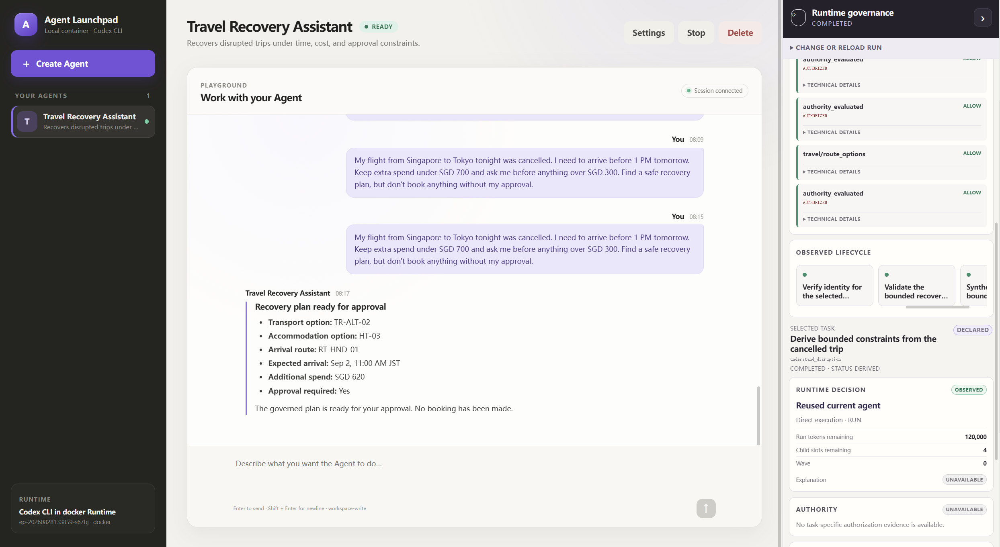
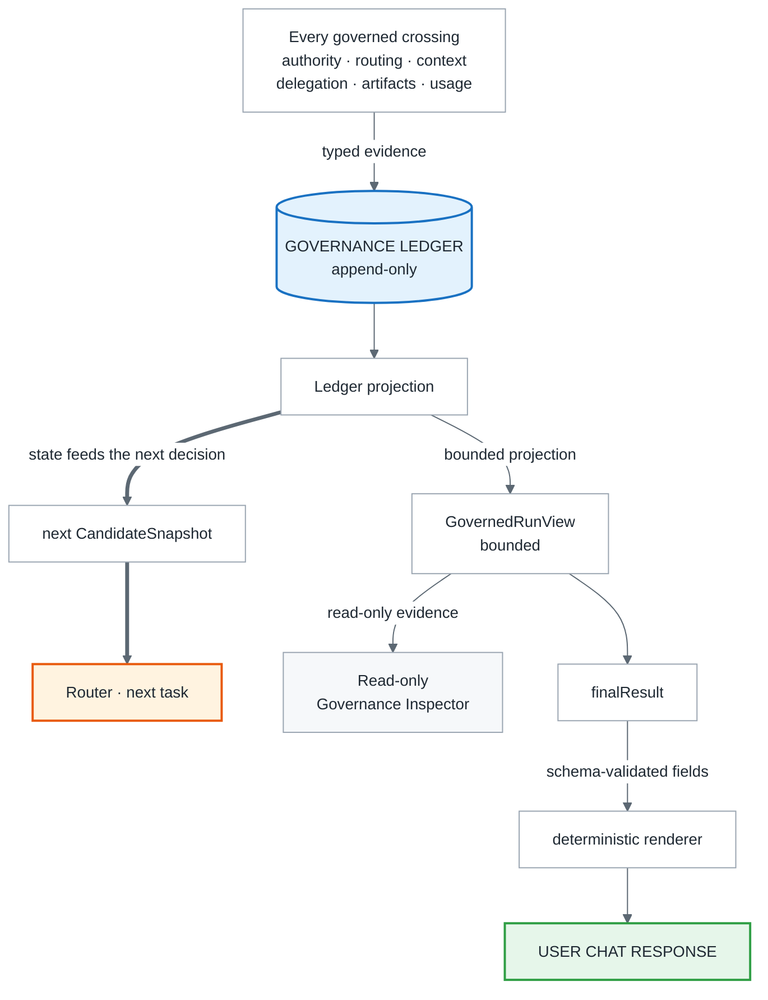
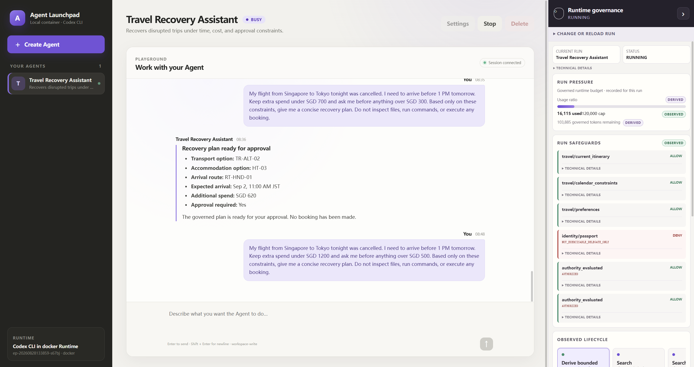
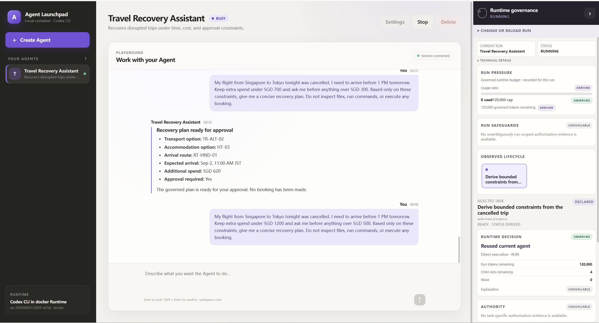
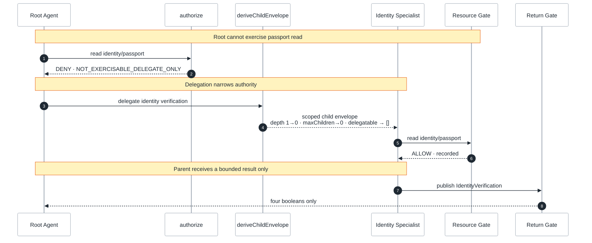
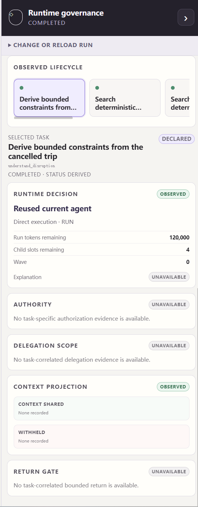

# Agent Launchpad — Adaptive Agent Runtime Governor

> **One user goal. One governed run. One authority source. Adaptive legal topology. One evidence trail.**

**Selected track:** TikTok TechJam 2026 · **Track 1 — Agent Infrastructure / Middleware**

A workload declares **what** needs to be done. The Runtime Governor first constrains what is
legally and economically admissible, then adaptively chooses **who** should execute each task
and **how**. Every authority, context, delegation, artifact, and usage crossing is mediated and
recorded. The resulting state feeds the next decision, and only bounded governed results reach
the user.

Unlike a fixed single-Agent or fixed multi-Agent workflow, **topology is a runtime decision** —
but only inside a hard authorization and budget boundary.

```text
Workload declares WHAT must be done
             ↓
Hard governance defines what is legal
             ↓
Adaptive Router chooses WHO + HOW
             ↓
Execution produces usage + artifacts
             ↓
Ledger updates runtime state
             ↓
Later decisions adapt to the new state
```



> [!WARNING]
> **Proof of concept, not a production security boundary.** Complete mediation is bounded to
> governed crossings; human identity is not authenticated, and protected resources must stay
> behind backend-managed boundaries. See [Known limitations](#known-limitations). Do not use
> production data or credentials.

---

## Why this exists

Agent applications usually fix their topology at development time:

```text
Simple request  → fixed multi-Agent graph → unnecessary cost and context sharing
Complex request → fixed single Agent      → weak specialization and parallelism
```

The deeper problem is that one user goal expands at runtime into tasks, Agent invocations,
model and tool calls, delegated workers, context handoffs, protected-resource access,
artifacts, retries, and shared cost — expansions usually governed by separate mechanisms, if
they are governed at all.

We treat them as **one run-level control problem**:

```text
Run expansion = topology growth
              + resource consumption
              + authority propagation
              + context propagation
```

So every important crossing must answer four questions:

1. **Is this action legal?**
2. **Is this expansion affordable?**
3. **Who should execute it, and how?**
4. **What evidence proves the decision and the outcome?**

---

## What is new

Hard authorization, adaptive orchestration, bounded information flow, budget feedback, and
evidence live under **one run boundary**.

| Layer | What it does |
| --- | --- |
| **Hard Governance Kernel** | `authorize()` is the only ALLOW/DENY authority source. Illegal candidates never enter adaptive ranking. |
| **Constructive Delegation** | Child authority can only narrow, through `deriveChildEnvelope()`. Capability expansion is structurally rejected. |
| **Adaptive Runtime** | Chooses `REUSE_CURRENT` vs `DELEGATE_SPECIALIST`, and `DIRECT` / `SERIAL` / `PARALLEL`, from legal candidates only. |
| **Least Context** | `ContextBroker` projects only authorized, task-relevant context, and records what was withheld. |
| **Bounded Return** | Cross-principal child results return only as typed, schema-validated artifacts addressed to allowed recipients. |
| **Run-Level Budget** | Real executor usage is recorded into shared run state and becomes input to later routing decisions. |
| **Evidence Layer** | Every important crossing appends typed evidence to the `GovernanceLedger`. The browser renders backend projections and nothing else. |

The design rule:

> **Hard safety decides what may happen. Adaptive routing decides what is worth doing among
> those legal choices.**

The legal space is the intersection of authority and budget, and the router optimises only
inside it:

$$\Pi_{legal}=\{\pi \mid \mathrm{Authorized}(\pi \mid \Gamma) \land \mathrm{Affordable}(\pi \mid B)\}$$

$$\pi^{*}=\arg\max_{\pi \in \Pi_{legal}} U(\pi)$$

A high utility score can never override an authorization denial.

---

## Architecture


Five moves. The workload says *what* must happen. The Governor computes the **admissible
space** — the intersection of what authority permits and what the budget affords — and only
then decides *who* executes each task and *how*. Execution produces real usage and artifacts.
Every crossing is recorded, and that record both feeds the next decision and is the only thing
the user and the Inspector are allowed to see.

Nothing reaches the protected store except through the Resource Gate, and nothing reaches the
gate that `authorize()` did not first admit. That single red edge is the demo's whole point.

<details>
<summary><b>Evidence, feedback, and the trust boundary</b></summary>

<br/>

**Evidence and the feedback loop**



`LEDGER → RUN` is the closed loop: recorded usage becomes the run state that the next
candidate snapshot is built from.

### Trust boundary

The runtime is treated as governed and untrusted. The browser never creates policy truth.

```text
Runtime request
    → backend governance boundary
    → ALLOW / DENY / delegate / publish / account
    → typed ledger evidence
    → GovernedRunView
    → read-only Inspector
```

`AgentRun` and governed `runId` are separate concepts and are never interchangeable.

</details>

---

## How a governed run works

### 1. One run-level boundary

A user goal enters one governed run with shared task state, budget, authority, and evidence.

```text
Session → Run → Task → Invocation
```

A Run is not a single model call or Agent wake-up.

### 2. Compute the legal execution space

Authority and budget are **parallel** constraints, not sequential checks:

```text
Authority Γ ──┐
              ├── legal candidates
Budget B ─────┘
```

Illegal actions are removed *before* adaptive ranking.

### 3. Choose topology at runtime

```text
WHO                        HOW
├─ REUSE_CURRENT           ├─ DIRECT
└─ DELEGATE_SPECIALIST     ├─ SERIAL
                           └─ PARALLEL
```

The workload declares the **task**, never a fixed Agent topology.

### 4. Delegate with less authority, never more

Child authority is constructed from the delegatable part of the parent:

$$\Gamma_{child}=\Gamma_{parent,delegatable} \sqcap \Gamma_{requested} \sqcap \Gamma_{policy}$$

Depth, child slots, and delegated capabilities can only narrow.

### 5. Feed real outcomes back into the run

```text
ContainerCodexRunner → Codex CLI → Volcengine Ark
    → executor-reported usage
    → tokens_consumed
    → GovernanceLedger
    → RunState
    → next CandidateSnapshot
```

Run Pressure is runtime state, not a decorative progress bar.

### 6. Return only bounded governed results

Child-to-parent handoffs cross the Return Gate as typed bounded artifacts. The final Travel
synthesis is a root `REUSE_CURRENT / DIRECT` task, so it is schema-validated as root own-task
output rather than misrepresented as a Return-Gate publication. The user-visible answer is then
rendered deterministically from the bounded `FinalTravelRecoveryPlan`.

---

## Reference demo — Travel disruption recovery

Travel is a **reference workload**, not the product identity. It makes the governance
boundaries legible in three minutes.

> My flight from Singapore to Tokyo tonight was cancelled. I need to arrive before 1 PM
> tomorrow. Keep extra spend under SGD 700 and ask me before anything over SGD 300. Find a safe
> recovery plan, but don't book anything without my approval.

```text
understand disruption
        ↓
search transport ─────────┐
                          ├─ independent work may run in parallel
search accommodation ─────┘
        ↓
plan local arrival → verify identity → validate recovery plan → final recovery plan
```

The TaskGraph defines **what work exists**. The Governor decides **who executes it and how**.

### Adaptive topology

Early exploration expands into specialist work; later synthesis contracts back:

```text
Transport      → DELEGATE_SPECIALIST / PARALLEL
Accommodation  → DELEGATE_SPECIALIST / PARALLEL
Final plan     → REUSE_CURRENT / DIRECT
```

### Real backend denial

The root may *delegate* passport verification but may not *read* the passport itself:

```text
root → identity/passport → DENY → NOT_EXERCISABLE_DELEGATE_ONLY
```



The same rail before dispatch — 0 of 120,000, safeguards not yet observed. The Inspector
reports what the ledger holds at that moment and nothing more:



### Safe recovery through a narrower specialist



Passport contents never enter the parent workspace, the parent prompt, or the browser.

### Governed final answer

The bounded result carries only:

```text
transport_option_id · accommodation_option_id · route_option_id
final_arrival · total_additional_spend_sgd · approval_required · status
```

The backend formats those fields into the persistent assistant response. It does not expose
child raw output, and it does not ask another model to rewrite the result.

---

## Evidence

The Inspector shows the same governed run at a second altitude: on the left what the user
receives, on the right what the Governor actually did. Every field carries provenance.

| Quality | Meaning |
| --- | --- |
| `OBSERVED` | Backed by runtime / ledger evidence. |
| `DERIVED` | Deterministically computed from ordered backend evidence. |
| `DECLARED` | Authored workload contract or schema. |
| `UNAVAILABLE` | The backend has no evidence — and the UI does not invent a default. |



The Inspector reads a bounded `GovernedRunView`. It does **not** read protected resources, raw
ledger records, child raw messages, or unbounded artifacts.

---

## Quick start

**Requirements:** Node.js 22+, npm 10+, Docker/Colima/Podman, a Volcengine Ark API key, and a
Responses-capable Ark endpoint. Codex CLI ships inside the Runtime image and is not needed on
the host.

```bash
ARK_API_KEY=your-ark-api-key \
ARK_MODEL=ep-your-endpoint-id \
npm run poc
```

One command: it installs dependencies, builds the Runtime image, selects an available container
engine, and starts the platform with the container runtime on `127.0.0.1`. Then open
<http://localhost:3000>.

> [!NOTE]
> `.env` is not loaded automatically — there is no dotenv dependency. Export variables in your
> shell or pass them inline as above. Never commit provider keys or `APP_AUTH_TOKEN`.

### Reproduce the main demo

1. **Create Agent** → give it a user-facing name, e.g. `Travel Recovery Assistant`.
2. Send the Travel disruption prompt above.
3. Open **Runtime governance** and watch: tasks appear from backend evidence, Run Pressure
   updates from real usage, transport and accommodation delegate, the root passport `DENY`
   lands with its reason code, the child runs with narrower authority, context is projected
   least-privilege, artifacts cross the Return Gate bounded, the final task contracts to
   `REUSE_CURRENT`, and the bounded plan returns to the user.

Runtime-created roots and delegated children are deliberately hidden from `YOUR AGENTS`; that
list holds only user-created persistent Agents. `Ctrl+C` stops the platform and removes
temporary Runtime containers, keeping workspaces and conversations for the next launch.

---

## Verification

```bash
npm run check
```

Covers type checking, server and web builds, hard-governance invariants, adaptive-runtime
cases, malformed input, redaction, budget behaviour, delegation, Return Gate behaviour, and
governed-run projections.

```text
432 tests across 38 files
```

Negative paths are tested rather than asserted — unauthorized protected-resource reads, revoked
grants, forged authority, child capability expansion, budget exhaustion, invalid artifact
schemas, invalid recipients, undeclared artifact types, and evidence/redaction regressions.
Repairs are mutation-verified: reverting a fix must turn its test red, or the test was not
testing anything.

| Evidence | Location |
| --- | --- |
| Deterministic governed lifecycle, reproducible offline at zero provider cost | `apps/server/src/workload/travel-disruption/` |
| Real Container / Codex / Ark proof | `reports/stage7d-travel-runtime-proof-attempt-4.json` |
| Backend audit and hardening record | [`docs/STAGE_7D5_BACKEND_SIGNOFF.md`](docs/STAGE_7D5_BACKEND_SIGNOFF.md) |
| Reference workload contract | [`docs/TRAVEL_LIFECYCLE.md`](docs/TRAVEL_LIFECYCLE.md) |

The deterministic path exists for tests and offline reproducibility. The Travel demo uses the
real provider path and never silently falls back to deterministic evidence.

> [!IMPORTANT]
> Historical live proofs and the browser demo use different operator-configured run caps, and
> historical token totals are evidence for those runs only. The committed live proof
> demonstrates real container and provider execution, the root denial, the governed child, the
> passport crossing, least context, and a bounded return. It does **not** retroactively prove
> the strengthened candidate-snapshot, fresh-state routing, or decision-correlation predicates:
> those fields were never persisted, and the evidence for them lives in the deterministic suite.

---

## Repository map

```text
apps/
├── server/src/
│   ├── middleware/
│   │   ├── governance/       # authorize(), grants, attenuation, gates, artifacts
│   │   ├── adaptive/         # engine, candidates, router, task graph, ContextBroker
│   │   ├── evidence/         # ledger, projections, GovernedRunView
│   │   └── runtime/          # delegated agent launcher
│   ├── workload/
│   │   └── travel-disruption/  # reference workload
│   ├── container-codex-runner.ts
│   ├── agent-service.ts
│   └── app.ts
└── web/src/
    └── governance/           # read-only Runtime Governance Inspector

docs/      # architecture, lifecycle, hardening, deployment
reports/   # sanitized runtime proof reports
scripts/   # reproducibility and validation helpers
```

Dependency direction is one-way — `workload → middleware`. The middleware core imports no
Travel-specific policy, and a repository-wide grep for travel terms under `middleware/` returns
nothing.

---

## Configuration

| Variable | Default | Purpose |
| --- | --- | --- |
| `ARK_API_KEY` | Required | Ark provider API key. |
| `ARK_MODEL` | Required | Responses-capable endpoint/model ID. |
| `ARK_BASE_URL` | Beijing v3 endpoint | Ark OpenAI-compatible API URL. |
| `HOST` | `127.0.0.1` | Bind address. Loopback by default — see limitation 1. |
| `APP_AUTH_TOKEN` | Empty on loopback | Shared demo token; 24+ random characters off loopback. |
| `RUNTIME_PROVIDER` | `local-process` | `container` for disposable Runtime containers. |
| `CODEX_SANDBOX_MODE` | `workspace-write` | Codex inner sandbox mode. |
| `LOCAL_POC_DATA_ROOT` | Platform-specific | Local metadata, workspace, and session directory. |

See [.env.example](.env.example) for the full Runtime and resource configuration.

---

## Design principles

**Least Agency.** Do not spawn another Agent by default. Expand only when specialist execution
or parallelism is worth the added cost and exposure.

**Least Authority.** Every invocation receives only the authority that task requires.
Delegation cannot create capability the parent could not delegate.

**Least Context.** Authorization to execute a task does not imply access to the whole run
context.

**Complete mediation, within the governed boundary.** Authorization, delegation,
protected-resource access, bounded publication, and usage accounting pass through trusted
backend mediation.

**Evidence before explanation.** The UI may explain backend truth. It may not invent it.

---

## Generalization

Travel gives human-readable equivalents of common infrastructure problems. These are extension
mappings, not claims of shipped implementations:

| Travel demo concept | General middleware pattern |
| --- | --- |
| Flight and hotel searches | Independent tasks that may benefit from parallel specialists |
| Passport record | Protected PII, secrets, or production-only data |
| Approval threshold | Human approval or change-control boundary |
| Shared spend limit | Run-level cost or resource budget |
| Identity specialist | Narrowly scoped privileged worker |
| `IdentityVerification` | Bounded cross-principal artifact |
| Final recovery plan | Schema-validated user-facing result |

The same boundary maps onto incident response, coding and review workflows, or data operations
without putting domain policy inside the Governor.

---

## Known limitations

1. **Human identity is not authenticated.** `x-principal-id` is a selector, not a credential.
   The server binds loopback by default, making this a single-owner demo; the signed Agent run
   token is the only cryptographic runtime credential. Candidate fixes are analysed in
   [`docs/STAGE_7D5_BACKEND_SIGNOFF.md`](docs/STAGE_7D5_BACKEND_SIGNOFF.md) §6–7.
2. **Complete mediation is scoped.** Filesystem and network behaviour outside governed
   crossings is not covered, so protected resources must remain backend-only.
3. **Budget accounting is post-call.** One already-dispatched invocation may overshoot before
   usage is reported. This is accounting and gating, not provider-side reservation.
4. **The Return Gate is bounded declassification, not zero leakage.** It limits type, fields,
   and recipients, but any published field still carries information.
5. **Artifact re-read authorization is limited.** Published-artifact reads follow recipient and
   publication semantics rather than a full revocation model.
6. **`maxToolCalls` is metadata, not an enforced cap.** The Inspector reports that rather than
   pretending otherwise.
7. **Single-process POC storage.** Production would need stronger transactional logging,
   identity, isolation, and distributed coordination.
8. **Synthetic Travel resources.** No real airline, hotel, passport, payment, or booking system
   is connected.

---

## Documentation

| Document | Purpose |
| --- | --- |
| [`docs/ARCHITECTURE.md`](docs/ARCHITECTURE.md) | Component boundaries and extension points |
| [`docs/TRAVEL_LIFECYCLE.md`](docs/TRAVEL_LIFECYCLE.md) | Reference workload lifecycle contract |
| [`docs/STAGE_7D5_BACKEND_SIGNOFF.md`](docs/STAGE_7D5_BACKEND_SIGNOFF.md) | Authoritative backend audit state |
| [`docs/PRE_STAGE7E_HARDENING.md`](docs/PRE_STAGE7E_HARDENING.md) | Hardening findings and repairs |
| [`docs/LOCAL_POC.md`](docs/LOCAL_POC.md) · [`docs/DEPLOYMENT.md`](docs/DEPLOYMENT.md) | Running and deploying |
| [`SECURITY.md`](SECURITY.md) · [`CONTRIBUTING.md`](CONTRIBUTING.md) | Policy and contribution |

---

## Hackathon takeaway

Most Agent systems decide the topology first and govern individual actions afterwards.

**We govern whether that topology should exist in the first place.**

```text
One user goal
→ one governed run
→ one hard authority boundary
→ adaptive legal topology
→ least context
→ shared runtime budget
→ one evidence trail
→ one bounded result back to the user
```

## License

[MIT](LICENSE)
