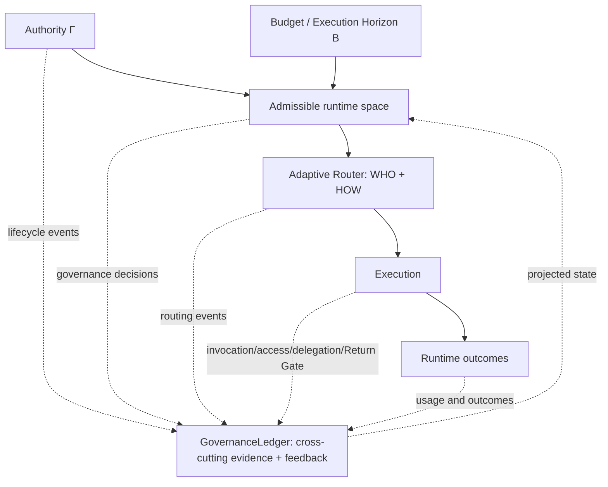

# Architecture

Volc Agent Launchpad is a single-node control plane for hackathon use.

## Governed system architecture

Authority Γ and Budget / Execution Horizon B are parallel constraint
dimensions. They jointly define the admissible runtime space; neither creates
or rescues the other. Adaptive routing chooses WHO and HOW inside that space.



The GovernanceLedger spans the governed lifecycle: authority/grant lifecycle,
hard decisions, routing, context projection, invocation, resource/tool access,
delegation, artifact/Return Gate, usage, and task/run outcomes. It is the sole
append-only runtime evidence trail and event-driven projection-update path for
event-derived mutable runtime state. `JsonStore` is not fully event-sourced; it
also directly persists application and authoritative objects.

## Decision pipeline

```text
Task -> CandidateSnapshot -> AuthorityView + BudgetView
  -> hardEligible + planningFit -> routableNow
  -> Router -> WHO + HOW -> dispatch
```

`planningFit` distinguishes `FITS_ESTIMATE` from `ESTIMATED_SHORTFALL`; an
estimated shortfall is not hard budget exhaustion. “Smallest worthwhile” is a
deterministic demo/evaluation heuristic rather than a globally optimized
topology. Specialist-required or authority-forced delegation may expand agency
without an ordinary marginal-utility comparison.

## Runtime feedback loop

```text
Decision_t -> Execution_t -> actual outcome / tokens_consumed
  -> GovernanceLedger -> RunState / GrantState projections
  -> CandidateBuilder_(t+1) -> Decision_(t+1)
```

Actual reported usage feeds later decisions. Task graphs and workload hints
remain declared/static inputs, and provider usage reporting is trusted.

## Components

### Web UI

Lists Agents, manages lifecycle actions, submits prompts, and polls asynchronous
Runs. It never receives the Ark API key.

### Fastify API

Validates requests, protects remote demos with a shared bearer token, and
serves the compiled Web UI. The shared app token is not Runtime principal
identity; governed crossings authenticate separately with bounded run tokens.

### AgentService

Coordinates lifecycle state, persistence, workspaces, and Runs. One Agent can
have only one active Run.

```text
ready -> busy -> ready
  |       |
  v       v
stopped  error
```

Interrupted Runs become `cancelled` after a restart.

### Storage

```text
data/launchpad.json       Agent, message, and Run metadata
workspaces/AgentID/       Agent-created files
workspaces/.deleted/      Archived deleted workspaces
codex-home/               Codex configuration and sessions
```

`JsonStore` serializes writes and atomically replaces one JSON file. It supports
one process only. Normal application state may include prompts, assistant
outputs, messages and AgentRun data. Governance evidence excludes raw prompts,
provider credentials, protected resource contents, RUN_TOKEN and raw child
assistant output.

### Adaptive Agent Runtime Governor

The governor mediates Bouncer-managed resource, trusted-tool, delegation,
artifact/Return and model-budget dispatch crossings. Per-provider-call model
interception is not implemented, token accounting is post-hoc, and one
in-flight call per principal may overshoot. `maxToolCalls` is authority metadata
only and is not enforced. HG-14 complete mediation is therefore **PARTIAL**.

Child-to-parent governed handoff uses bounded typed artifacts. This reduces
explicit information flow but does not eliminate covert channels, reverse
already-completed external effects, or govern arbitrary filesystem/network
access available under `danger-full-access`.

### Runtime providers

- `CodexRunner` runs Codex inside the application container for ECS.
- `ContainerCodexRunner` starts one disposable Docker, Colima, or Podman
  container for every local turn.

Both providers use argv-only process execution, bound output and time, resume
the stored Codex thread, and escalate termination after a grace period.

## Deployment profiles

| Profile | Control plane | Agent execution |
| --- | --- | --- |
| Local POC | Host Node.js | Disposable local container |
| ECS | Application container | Codex process in the same container |
| Local development | Host Node.js | Host Codex process |

## Extension seams

| Track | Primary seam | Expected change |
| --- | --- | --- |
| Glass Box | `AgentRunner`, `AgentRun` | Emit and display correlated execution events. |
| Bouncer | Governance middleware and governed API routes | Extend only through the frozen authorization and evidence boundaries. |
| Kill Switch | `AgentRunner` | Add threat-specific policy or a stronger sandbox. |

The current container or ECS instance is the POC trust boundary. Ordinary
containers are not hardened multi-tenant isolation.
